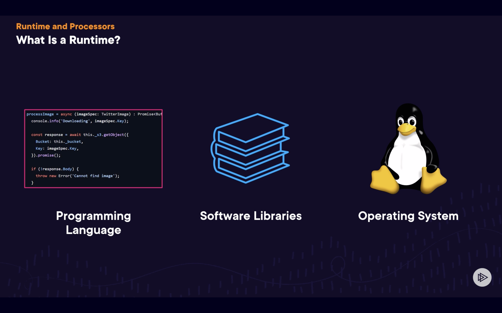
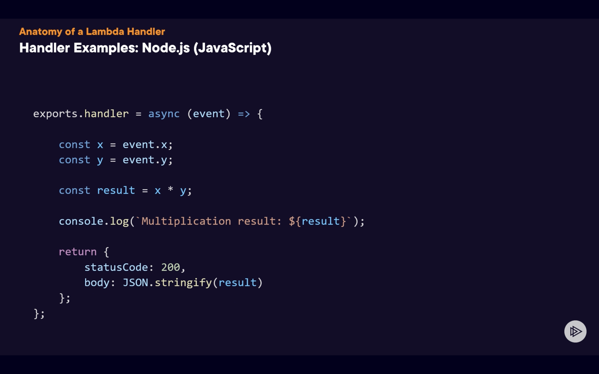
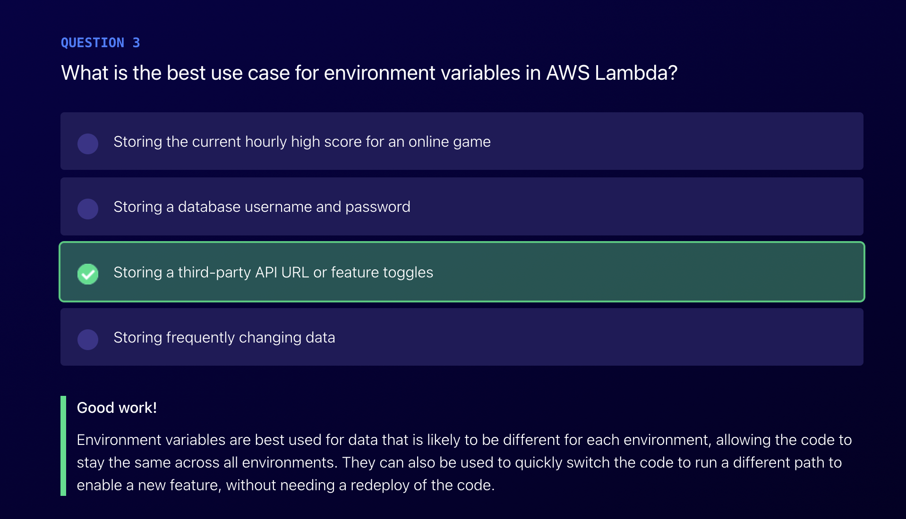

# Lambda-Deep-Dive

Lambda in AWS is a serverless computing service that allows users to run code in response to events without provisioning or managing servers.

Examples of such events:

## What is a Lambda Runtime

- A Lambda runtime, in simple terms, is the environment provided by AWS Lambda that allows you to run your function code. It includes the language interpreter or the execution environment needed for your code. For example, if your Lambda function is written in Python, the runtime will be a specific version of Python, such as Python 3.8, which interprets and executes your Python code. The runtime takes care of managing the resources your code needs to run and integrates with other AWS services to process events and execute the function accordingly. Essentially, it's what allows your function to run within the AWS ecosystem without needing to manage servers or operating systems.

## What is a Lambda Handler

- In simple terms, a Lambda handler in AWS is like the main function in your code—it's the starting point where AWS Lambda begins executing your custom code when the function is triggered.

- It is the entry point or function within an AWS Lambda function that is executed when the function is invoked. It typically specifies the code to be executed and any necessary event data processing.

- When a request is made to an AWS Lambda function, it's typically divided into two main components: the event object and the context object. The event object contains the data or information about the event that triggered the Lambda function, such as an HTTP request or a message from an AWS service. The context object provides runtime information about the Lambda execution environment and allows the function to interact with AWS services and resources, such as logging or accessing configuration settings. These two objects work together to provide the necessary inputs and context for the Lambda function to execute successfully.

- The event object and the context object are passed into the handler method, where they are used to run some processing and return a result

#### See event handler template below: 

#### Lambda configurations:

